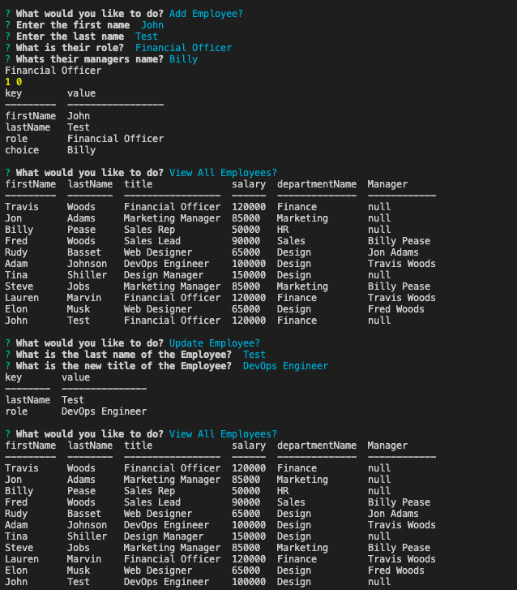

# Employee Tracker

## Description
  This application was created so users can track employees using a database. Users are able to view all employees, departments, and roles. Users can also add employees, departments, roles and update employees from the terminal. 

## Table of Contents 

- [Installation](#installation)
- [Usage](#usage)
- [License](#license)
- [Contributing](#repo)
- [Credits](#credits)
- [Tests](#test)

## Installation
  npm i for dependencies and then login to mysql shell. You can then source the database using source db/schema.sql and then seed the database with source db/seed.sql 

## Usage
  Please run with node index.js

  

  

  

  

  Walkthrough Video: https://drive.google.com/file/d/1iGnEUHdT3Sz0d59Kper2dxDW37eRUhYW/view

## License

https://opensource.org/licenses/IPL-1.0

## Credits

[My GitHub: woodstr3313](https://github.com/woodstr3313)

[My Social-Network-API GitHub](https://github.com/woodstr3313/Employee-Management-System)

[My email: woodstr3313@gmail.com](email:woodstr3313@gmail.com)

## How to Contribute
  Please contact me at woodstr3313@gmail.com if you would like to contribute.

## Tests
  Currently no tests
